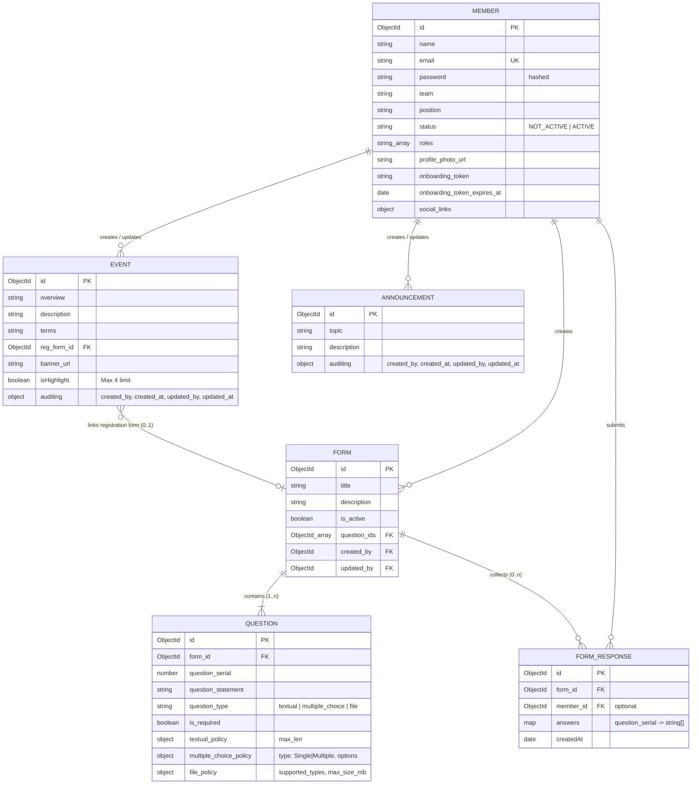
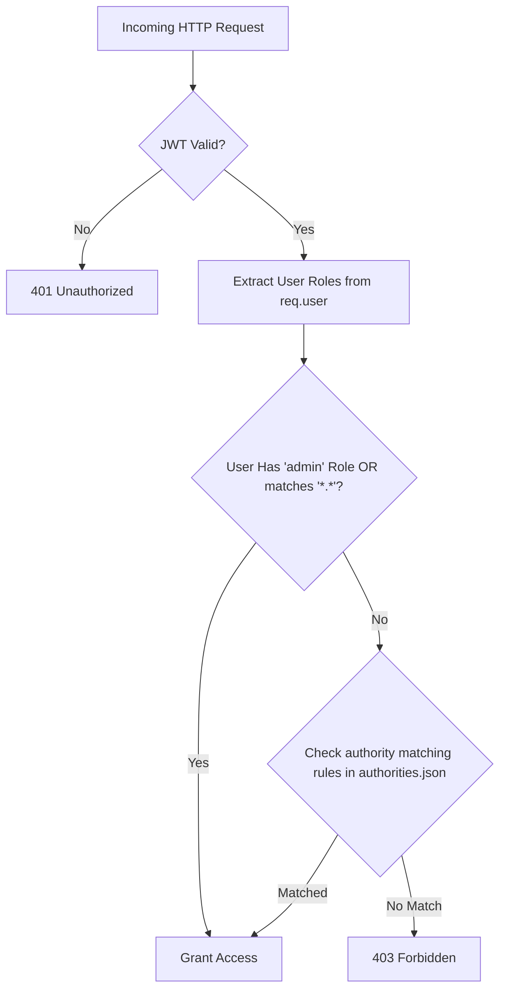
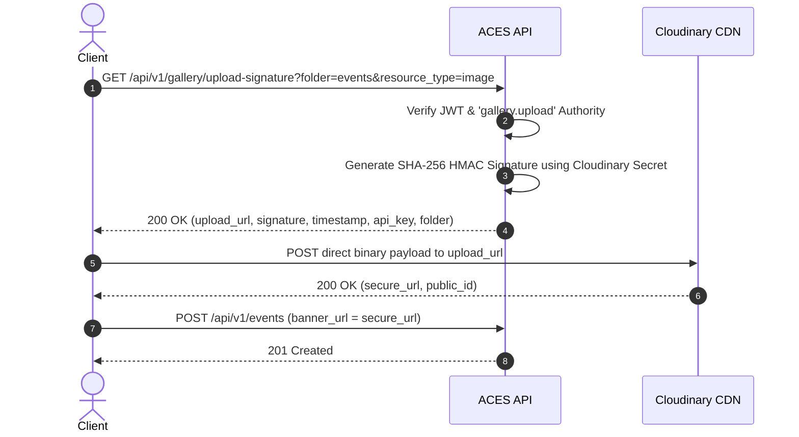

# ACES API — Architectural & Design Specification

This document presents the authoritative technical design and system architecture for the **ACES API** backend platform. It serves as the single source of truth for software engineers, solution architects, and maintainers.

---

## Table of Contents
1. [Architecture Overview & Design Philosophy](#1-architecture-overview--design-philosophy)
2. [Directory Structure & Boundary Enforcement](#2-directory-structure--boundary-enforcement)
   - [Package-Oriented Design](#package-oriented-design)
   - [Domain Isolation Rules](#domain-isolation-rules)
   - [Automated ESLint Guardrails](#automated-eslint-guardrails)
3. [Data Architecture & System ERD](#3-data-architecture--system-erd)
   - [Entity-Relationship Diagram](#entity-relationship-diagram)
   - [Module Data Schemas](#module-data-schemas)
4. [Security, Authentication & RBAC Architecture](#4-security-authentication--rbac-architecture)
   - [Stateless JWT Authentication](#stateless-jwt-authentication)
   - [Authority Management Engine](#authority-management-engine)
   - [Team Hierarchy & Canonical Resolution](#team-hierarchy--canonical-resolution)
5. [Digital Asset Management & CDN Direct Offloading](#5-digital-asset-management--cdn-direct-offloading)
   - [Presigned Upload Architecture](#presigned-upload-architecture)
   - [Upload Signature Sequence](#upload-signature-sequence)
6. [Dynamic Form Engine & Policy Validation](#6-dynamic-form-engine--policy-validation)
   - [Question Type Polymorphism & Policy Schemas](#question-type-polymorphism--policy-schemas)
   - [Response Validation Engine](#response-validation-engine)
   - [Cascade Deletion Transaction Strategy](#cascade-deletion-transaction-strategy)
7. [Cross-Cutting Technical Concerns](#7-cross-cutting-technical-concerns)
   - [Centralized Exception Pipeline](#centralized-exception-pipeline)
   - [Unified API Response Envelope](#unified-api-response-envelope)
   - [Automated Audit Interceptors](#automated-audit-interceptors)
   - [Test Strategy & In-Memory Database Harness](#test-strategy--in-memory-database-harness)

---

## 1. Architecture Overview & Design Philosophy

The **ACES API** is designed as a **Modular Monolith**. This pattern combines the operational simplicity, simplified deployment, and low operational overhead of a monolithic application with the clear domain boundaries, low coupling, and maintainability of microservices.

```text
               ┌─────────────────────────────────────────┐
               │    Client Application / Frontend        │
               └────────────────────┬────────────────────┘
                                    │ HTTP / REST
               ┌────────────────────▼────────────────────┐
               │    Orchestration (Gateway Layer)        │
               │   Middlewares: Auth, CORS, Helmet, Logs  │
               └─────────┬──────────┬──────────┬─────────┘
                         │          │          │
         ┌───────────────┴──┐   ┌───┴──────────┴───┐
         ▼                  ▼   ▼                  ▼
┌──────────────────┐ ┌─────────────┐ ┌───────────────────┐
│    IAM Module    │ │ Events Pkg  │ │   Forms Pkg       │ ...
│ (Public Contract)│ │ (Public)    │ │ (Public Service)  │
└────────┬─────────┘ └──────┬──────┘ └─────────┬─────────┘
         │ Private          │ Private          │ Private
┌────────▼─────────┐ ┌──────▼──────┐ ┌─────────▼─────────┐
│  iam/internal    │ │events/intern│ │  forms/internal   │
└──────────────────┘ └─────────────┘ └───────────────────┘
```

### Core Architecture Principles
1. **Domain Cohesion & Encapsulation**: Each business capability (`iam`, `events`, `forms`, `announcements`, `gallery`) resides in its own isolated module.
2. **Explicit Public Service Contracts**: Modules communicate exclusively through public service exports defined in each module's `index.js`.
3. **Offloading I/O Bottlenecks**: Heavy binary file uploads are offloaded directly to Cloudinary CDN via presigned upload signatures, keeping the single-threaded Node.js event loop free of memory clutter.
4. **Resilient Data Contracts**: Database schemata enforce auditing metadata and strict policy schemas.

---

## 2. Directory Structure & Boundary Enforcement

### Package-Oriented Design
Every domain module adheres strictly to a standard package layout:

```text
aces_api/
├── orchestration/              # Gateway & Application Assembly Layer
│   ├── http/                   # Express routes composition & app setup
│   └── middleware/             # Global middlewares (Auth, Logger, ErrorHandler)
├── iam/                        # Identity & Access Management Module
│   ├── index.js                # PUBLIC CONTRACT (Exports IAMService)
│   ├── http/                   # HTTP Controllers & Routes
│   └── internal/               # PRIVATE (Mongoose Schemas, Internal Services)
├── events/                     # Event Management Module
│   ├── index.js                # PUBLIC CONTRACT (Exports EventsService)
│   ├── http/                   # HTTP Controllers & Routes
│   └── internal/               # PRIVATE (Event Schema, Highlight validation)
├── forms/                      # Dynamic Form & Response Consolidation Module
│   ├── index.js                # PUBLIC CONTRACT (Exports FormsService)
│   ├── http/                   # HTTP Controllers & Routes
│   └── internal/               # PRIVATE (Form, Question, Response Schemas)
├── announcements/              # News & Broadcasts Module
│   ├── index.js                # PUBLIC CONTRACT (Exports AnnouncementsService)
│   ├── http/                   # HTTP Controllers & Routes
│   └── internal/               # PRIVATE (Announcement Schemas)
├── gallery/                    # Digital Media Asset Management Module
│   ├── index.js                # PUBLIC CONTRACT (Exports GalleryService)
│   ├── http/                   # HTTP Controllers & Routes
│   └── internal/               # PRIVATE (Cloudinary Signer Utility)
└── shared/                     # Shared Utilities, Config, Errors, Constants
```

---

### Domain Isolation Rules

1. **Private Directory Seclusion**: No file outside a module may import from that module's `internal/` directory.
   ```javascript
   //  PROHIBITED: Importing internal models across domain boundaries
   import { Form } from '../forms/internal/form.model.js';

   //  APPROVED: Invoking public module service contract
   import { FormsService } from '../forms/index.js';
   ```
2. **Public Service Facade**: Each module root exports an explicit interface (`index.js`) encapsulating business operations.

---

### Automated ESLint Guardrails
Boundary enforcement is validated automatically during CI/CD using `eslint-plugin-import` path restriction rules:
```javascript
// eslint.config.js snippet
{
  rules: {
    'no-restricted-imports': ['error', {
      patterns: [{
        group: ['**/internal/**'],
        message: 'Direct imports from internal domain directories are prohibited. Use public module interface instead.'
      }]
    }]
  }
}
```

---

## 3. Data Architecture & System ERD

### Entity-Relationship Diagram



---

## 4. Security, Authentication & RBAC Architecture

### Defense-in-Depth Security Model
- **HTTP Security Headers**: Express apps configured with `helmet()` middleware.
- **CORS Protection**: Restricted to configured client domain origins (`config.clientOrigin`).
- **Credential Storage**: Passwords hashed using `bcryptjs` with salt factor 10.
- **Payload Inspection**: Protection against SQL/NoSQL injection via strict Mongoose typing.

---

### Authority Management Engine

Instead of scattering role checks across controllers, authorization relies on an **Authority Hierarchy Interceptor** (`orchestration/http/middleware/authorityManager.js`).

#### Resolution Algorithm


---

### Team Hierarchy & Canonical Resolution
Team affiliations and positions are parsed dynamically from `teams.txt` at runtime.

#### Features
1. **Alias Normalization**: Normalizes inputs like `"tech team"` to `"Technical Team"`.
2. **Role Auto-Derivation**: Map teams automatically to primary roles (e.g. `Event Team` -> `event_team`).
3. **Internal Team Concealment**: Administrative teams (`Executive`) are hidden from public member listing queries.

---

## 5. Digital Asset Management & CDN Direct Offloading

### Presigned Upload Architecture
To maintain maximum throughput and avoid memory starvation, client media uploads are offloaded directly to Cloudinary.



---

## 6. Dynamic Form Engine & Policy Validation

### Question Type Polymorphism & Policy Schemas

The forms engine supports three distinct question typologies:

```typescript
type QuestionType = 'textual' | 'multiple_choice' | 'file';

interface TextualPolicy {
  max_len: number; // Default: 500 characters
}

interface MultipleChoicePolicy {
  type: 'Single' | 'Multiple';
  options: string[];
}

interface FilePolicy {
  supported_types: string[]; // e.g. ['pdf', 'png', 'jpg']
  max_size_mb: number;       // Default: 5MB
}
```

---

### Response Validation Engine
Upon receiving a response submission:
1. **Active Check**: Ensures `Form.is_active === true`.
2. **Required Field Enforcement**: Validates that all questions marked `is_required: true` contain answers.
3. **Textual Policy Validation**: Confirms answer string length `<= textual_policy.max_len`.
4. **Multiple Choice Validation**: Verifies selection count (`Single` = 1, `Multiple` >= 1) and confirms selected values match defined `options`.

---

### Cascade Deletion Transaction Strategy
Deleting a form automatically cleans up dependent entities:
```javascript
static async deleteForm(form_id) {
  const form = await Form.findByIdAndDelete(form_id);
  if (!form) throw new NotFoundError('Form not found.');

  await Promise.all([
    Question.deleteMany({ form_id }),
    FormResponse.deleteMany({ form_id }),
  ]);
  return { form_id, message: 'Form and all associated data deleted successfully.' };
}
```

---

## 7. Cross-Cutting Technical Concerns

### Centralized Exception Pipeline

Errors inherit from `AppError` and are captured by `errorHandlerMiddleware`:

```text
           AppError (Operational Base Error)
              ├── ValidationError (400)
              ├── UnauthorizedError (401)
              ├── ForbiddenError (403)
              ├── NotFoundError (404)
              └── ConflictError (409)
```

---

### Unified API Response Envelope
- Success Response helper: `sendSuccess(res, data, statusCode = 200)`
- Error Response helper: returns `{ success: false, data: null, error: { code, message } }`

---

### Automated Audit Interceptors
Every mutating operation auto-injects audit metadata:
```json
{
  "auditing": {
    "created_by": "66bc1234567890abcdef1001",
    "created_at": "2026-08-14T12:00:00.000Z",
    "updated_by": "66bc1234567890abcdef1001",
    "updated_at": "2026-08-14T12:00:00.000Z"
  }
}
```

---

### Test Strategy & In-Memory Database Harness
Unit and integration tests are executed using the native Node.js test runner (`node --test`) paired with `mongodb-memory-server` for isolated, zero-dependency database testing.
